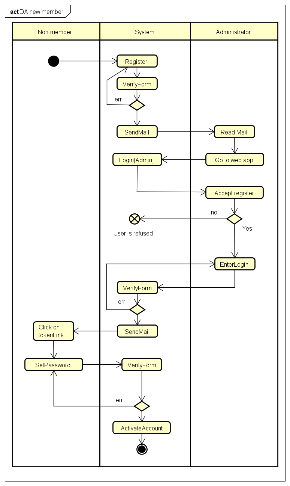

# Ajout d'un membre

## Pas à pas

1. L'utillisateur va s'enregistrer sur `/register`
  - si la vérification réussi, passe au 2
  - si la vérification échoue : rouvre le formulaire avec les erreurs
2. le système envoie un mail à l'administrateur
3. l'administreteur se connecte au site et va sur son panel d'administration
  - accepte l'inscription : donne un login a l'utilisateur
  - refuse : ignore le champ
4. le système envoie un mail a l'utilisateur avec un token et son login
5. l'utilisateur clique sur le lien du mail
6. l'utilisateur rentre un mot de passe
7. l'utilisateur va se connecter avec login / mot de passe

## diagramme d'activité

