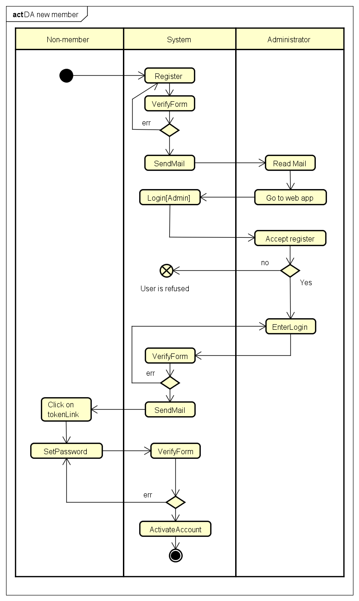

# Add member

## steb by step

1. User go on `/register`
  - if the verification of the inputs are valid, go to step 2
  - if verification failed : go again to the register form
2. System send a mail to the admin
3. Admin log in to his admin panel
  - accept : fill the login field and go to step 4
  - refuse : ignore field
4. System send a mail to the new user with the login and a link to set his password
5. User click on the link
6. User set his password
7. User log in with his new login/password

## diagramme d'activité

