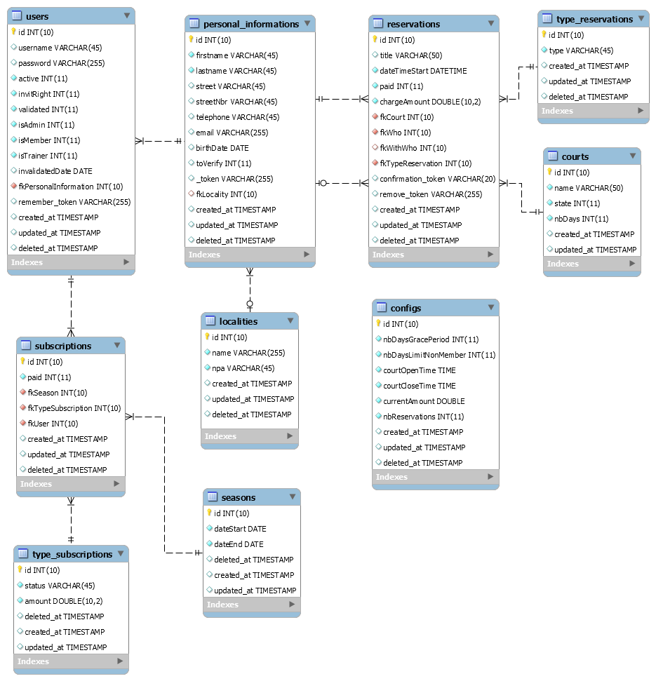

# Schema documentation for TCC

## MLD

## Table: `configs`

### Description:

Containes the configuration of certaine elements that are needed for the site to work.

### Columns:

| Column | Data type | Attributes | Default | Description |
| --- | --- | --- | --- | ---  |
| `id` | INT | PRIMARY, Auto increments, Not null |   |   |
| `nbDaysGracePeriod` | INT | Not null |   | Number of days before the account is fully locked/deactivated. |
| `nbDaysLimitNonMember` | INT | Not null |   | Number of days that are displayed for the courts for non-members. |
| `courtOpenTime` | TIME | Not null |   | Time at which the courts open. |
| `courtCloseTime` | TIME | Not null |   | Time at which the courts close. |
| `currentAmount` | DOUBLE | Not null |   | The amount that a non-member currently pays. |
| `nbReservations` | INT | Not null |   | Number of simultaneous (at same time) reservations a member can have. |
| `created_at` | TIMESTAMP |  | `NULL` |   |
| `updated_at` | TIMESTAMP |  | `NULL` |   |
| `deleted_at` | TIMESTAMP |  | `NULL` |   |

### Indices:

| Name | Columns | Type | Description |
| --- | --- | --- | --- |
| PRIMARY | `id` | PRIMARY |   |

## Table: `courts`

### Description:

The different courts that are available on site.

### Columns:

| Column | Data type | Attributes | Default | Description |
| --- | --- | --- | --- | ---  |
| `id` | INT | PRIMARY, Auto increments, Not null |   |   |
| `name` | VARCHAR(50) | Not null |   | The name of the court. |
| `state` | INT | Not null |   | The stat of the court. 0 = closed 1 = open |
| `nbDays` | INT | Not null |   | Number of days that are displayed for the court for members. |
| `created_at` | TIMESTAMP |  | `NULL` |   |
| `updated_at` | TIMESTAMP |  | `NULL` |   |

### Indices:

| Name | Columns | Type | Description |
| --- | --- | --- | --- |
| PRIMARY | `id` | PRIMARY |   |

## Table: `localities`

### Description:

The different localities that the users enter when they signup or modify their profile.

### Columns:

| Column | Data type | Attributes | Default | Description |
| --- | --- | --- | --- | ---  |
| `id` | INT | PRIMARY, Auto increments, Not null |   |   |
| `name` | VARCHAR(255) | Not null |   | The name of the village, town or city. |
| `npa` | VARCHAR(45) | Not null |   | The postale code of the village, town or city. |
| `created_at` | TIMESTAMP |  | `NULL` |   |
| `updated_at` | TIMESTAMP |  | `NULL` |   |
| `deleted_at` | TIMESTAMP |  | `NULL` |   |

### Indices:

| Name | Columns | Type | Description |
| --- | --- | --- | --- |
| PRIMARY | `id` | PRIMARY |   |

## Table: `personal_informations`

### Description:

Containes the personal informtaion of the members, non-members and the people that were invited to a game.

### Columns:

| Column | Data type | Attributes | Default | Description |
| --- | --- | --- | --- | ---  |
| `id` | INT | PRIMARY, Auto increments, Not null |   |   |
| `firstname` | VARCHAR(45) | Not null |   | The firstname of the person. |
| `lastname` | VARCHAR(45) | Not null |   | The lastname of the person. |
| `street` | VARCHAR(45) |  | `NULL` | The street where the person lives. |
| `streetNbr` | VARCHAR(45) |  | `NULL` | The street number of where the person lives. |
| `telephone` | VARCHAR(45) |  | `NULL` | The phone number of the person. |
| `email` | VARCHAR(255) |  | `NULL` | The e-mail address of the person. |
| `birthDate` | DATE |  | `NULL` | The date of when the person was born. |
| `toVerify` | INT |  | `NULL` | Field used if the member needs to validate their personal information. 0 = information validated (no need for validation) 1 = information invalid (needs validation)  If 1 the member will be redirected to their profile page when they connect to the site. |
| `_token` | VARCHAR(255) |  | `NULL` | Token for when the member is creating an account. |
| `fkLocality` | INT |  | `NULL` |  **foreign key** to column `id` on table `localities`. |
| `created_at` | TIMESTAMP |  | `NULL` |   |
| `updated_at` | TIMESTAMP |  | `NULL` |   |
| `deleted_at` | TIMESTAMP |  | `NULL` |   |

### Indices:

| Name | Columns | Type | Description |
| --- | --- | --- | --- |
| PRIMARY | `id` | PRIMARY |   |
| personal_informations_fklocality_foreign | `fkLocality` | INDEX |   |

## Table: `reservations`

### Description:

Containes all the reservation that members, non-members and staff make.

### Columns:

| Column | Data type | Attributes | Default | Description |
| --- | --- | --- | --- | ---  |
| `id` | INT | PRIMARY, Auto increments, Not null |   |   |
| `title` | VARCHAR(50) |  | `NULL` | The title of a reservation. Only used when a staff member makes a reservation. |
| `dateTimeStart` | DATETIME | Not null |   | The date and time that a reservation starts. |
| `paid` | INT | Not null |   | Indicates if the member has paid his/her subscription. 0 = unpaid 1 = paid |
| `chargeAmount` | DOUBLE | Not null |   | This is the amount that needs to be paid. |
| `fkCourt` | INT | Not null |   |  **foreign key** to column `id` on table `courts`. |
| `fkWho` | INT | Not null |   |  **foreign key** to column `id` on table `personal_informations`. |
| `fkWithWho` | INT |  | `NULL` |  **foreign key** to column `id` on table `personal_informations`. |
| `fkTypeReservation` | INT | Not null |   |  **foreign key** to column `id` on table `type_reservations`. |
| `confirmation_token` | VARCHAR(20) |  | `NULL` | This is a token that is used for when a non-member is making a reservation. The field containes a token until the non-member clicks on the link in the e-mail they recieved. |
| `remove_token` | VARCHAR(255) |  | `NULL` | This is a token that is used for when a non-member is deleting a reservation. The field containes a token until the non-member clicks on the link in the e-mail they recieved. |
| `created_at` | TIMESTAMP |  | `NULL` |   |
| `updated_at` | TIMESTAMP |  | `NULL` |   |
| `deleted_at` | TIMESTAMP |  | `NULL` |   |

### Indices:

| Name | Columns | Type | Description |
| --- | --- | --- | --- |
| PRIMARY | `id` | PRIMARY |   |
| reservations_fkwho_foreign | `fkWho` | INDEX |   |
| reservations_fkwithwho_foreign | `fkWithWho` | INDEX |   |
| reservations_fktypereservation_foreign | `fkTypeReservation` | INDEX |   |
| reservations_fkcourt_foreign | `fkCourt` | INDEX |   |

## Table: `seasons`

### Description:

The different seasons that have passed or are in the future.

### Columns:

| Column | Data type | Attributes | Default | Description |
| --- | --- | --- | --- | ---  |
| `id` | INT | PRIMARY, Auto increments, Not null |   |   |
| `dateStart` | DATE | Not null |   | When the season starts. |
| `dateEnd` | DATE | Not null |   | When the season ends. |
| `deleted_at` | TIMESTAMP |  | `NULL` |   |
| `created_at` | TIMESTAMP |  | `NULL` |   |
| `updated_at` | TIMESTAMP |  | `NULL` |   |

### Indices:

| Name | Columns | Type | Description |
| --- | --- | --- | --- |
| PRIMARY | `id` | PRIMARY |   |

## Table: `subscriptions`

### Description:

The subscription that a member has. It will change every season.

### Columns:

| Column | Data type | Attributes | Default | Description |
| --- | --- | --- | --- | ---  |
| `id` | INT | PRIMARY, Auto increments, Not null |   |   |
| `paid` | INT | Not null | `'0'` | Indicates if the member has paid his/her subscription. 0 = unpaid 1 = paid |
| `fkSeason` | INT | Not null |   |  **foreign key** to column `id` on table `seasons`. |
| `fkTypeSubscription` | INT | Not null |   |  **foreign key** to column `id` on table `type_subscriptions`. |
| `fkUser` | INT | Not null |   |  **foreign key** to column `id` on table `users`. |
| `created_at` | TIMESTAMP |  | `NULL` |   |
| `updated_at` | TIMESTAMP |  | `NULL` |   |
| `deleted_at` | TIMESTAMP |  | `NULL` |   |

### Indices:

| Name | Columns | Type | Description |
| --- | --- | --- | --- |
| PRIMARY | `id` | PRIMARY |   |
| subscriptions_fkseason_foreign | `fkSeason` | INDEX |   |
| subscriptions_fktypesubscription_foreign | `fkTypeSubscription` | INDEX |   |
| subscriptions_fkuser_foreign | `fkUser` | INDEX |   |

## Table: `type_reservations`

### Description:

The type of reservations that are possible.

### Columns:

| Column | Data type | Attributes | Default | Description |
| --- | --- | --- | --- | ---  |
| `id` | INT | PRIMARY, Auto increments, Not null |   |   |
| `type` | VARCHAR(45) | Not null |   | Describe what type of reservation it is. (aucune, quotidienne, hebdomadaire et mensuel) |
| `created_at` | TIMESTAMP |  | `NULL` |   |
| `updated_at` | TIMESTAMP |  | `NULL` |   |
| `deleted_at` | TIMESTAMP |  | `NULL` |   |

### Indices:

| Name | Columns | Type | Description |
| --- | --- | --- | --- |
| PRIMARY | `id` | PRIMARY |   |

## Table: `type_subscriptions`

### Description:

The different types of subscriptions that a member can have.

### Columns:

| Column | Data type | Attributes | Default | Description |
| --- | --- | --- | --- | ---  |
| `id` | INT | PRIMARY, Auto increments, Not null |   |   |
| `status` | VARCHAR(45) | Not null |   | Name (status) of a subscription. |
| `amount` | DOUBLE | Not null |   | The amount that the member will pay per season. |
| `deleted_at` | TIMESTAMP |  | `NULL` |   |
| `created_at` | TIMESTAMP |  | `NULL` |   |
| `updated_at` | TIMESTAMP |  | `NULL` |   |

### Indices:

| Name | Columns | Type | Description |
| --- | --- | --- | --- |
| PRIMARY | `id` | PRIMARY |   |

## Table: `users`

### Description:

Data for a member. Person has an account on the site.

### Columns:

| Column | Data type | Attributes | Default | Description |
| --- | --- | --- | --- | ---  |
| `id` | INT | PRIMARY, Auto increments, Not null |   |   |
| `username` | VARCHAR(45) |  | `NULL` | The username of the account. Used to login to the site. |
| `password` | VARCHAR(255) |  | `NULL` | The password of the account. Used to login to the site. |
| `active` | INT | Not null |   | The members account is activated or not. 0 = account disactivated 1 = account activated |
| `invitRight` | INT | Not null |   | The members account can invit somebody or not. 0 = can't invit somebody 1 = can invit somebody |
| `validated` | INT | Not null |   | The account has been validated by an admin of the sote. 0 = hasn't been validated. Waiting for admin to generate a username. 1 = has been validated. The member now has a username. |
| `isAdmin` | INT | Not null |   | The account is an adminstrator or not. 0 = isn't an administrator 1 = is an administrator |
| `isMember` | INT | Not null |   | The account is a member or not. 0 = isn't a member 1 = is a member |
| `isTrainer` | INT | Not null |   | The account is a staff or not. 0 = isn't a staff 1 = is a staff (staff = trainer/instructor) |
| `invalidatedDate` | DATE |  | `NULL` | Date at which the account was deactivated. Used with the grace period to know when to fully lock/deactivate the account. |
| `fkPersonalInformation` | INT | Not null |   |  **foreign key** to column `id` on table `personal_informations`. |
| `remember_token` | VARCHAR(255) |  | `NULL` | Used by the framework to help against "remember me" cookie hijacking. |
| `created_at` | TIMESTAMP |  | `NULL` |   |
| `updated_at` | TIMESTAMP |  | `NULL` |   |
| `deleted_at` | TIMESTAMP |  | `NULL` |   |

### Indices:

| Name | Columns | Type | Description |
| --- | --- | --- | --- |
| PRIMARY | `id` | PRIMARY |   |
| users_fkpersonalinformation_foreign | `fkPersonalInformation` | INDEX |   |
