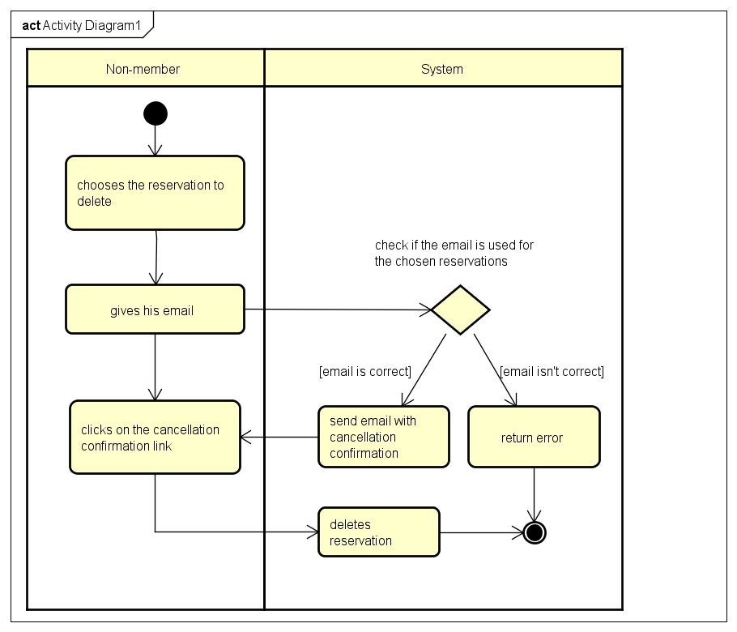

# Reservation
## Description
This part describes how the reservation feature of the application works and what is needed to create a reservation.
To Begin with, there are multiple kinds of reservations. The first one is, are reservations made by member and non-member. This type of reservation is used by "the client" of the site. It means the people who subscribe to the club and the people who want to play without belonging to the club. Then there's the staff booking, it's used by the staff of the club to make a reservation for an event: for example, a birthday.
Staff booking is also used to create multiple reservations: daily or weekly reservations for example it could be used to reserve a court for a training course.

#### General conditions to make a reservation
- The date of the reservation has to be in future
- The chosen court has to be open (not in maintenance)
- The hour for the chosen court has to be free

## Reservation for member/non-member
Controller: `app/Http/Controllers/Booking/BookingController.php`

Middleware: `app/Http/Middleware/ProfileIsValideMiddleware.php`

Layout: `resources/views/layouts/app.blade.php`

View: `resources/views/booking/home.blade.php`, main reservation view.

Subviews:
- `resources/views/booking/delete_modal.blade.php` is the modal display to delete a reservation
- `resources/views/booking/own_reservs.blade.php` is the table displayed to see made reservations past and future
- `resources/views/booking/reserve_modal.blade.php` is the modal used to make a reservations (by a non-member or member)

### Information needed to create a reservation
It's possible to make reservations as a member (person with account) or as a non-member (without log in).
If the reservation is made by a member, the member has to give with who they are going to play: member or non-member.
If he wants to play with a member, the member who made the reservation has to give the id of the personal information of the member to play with in (in the view, it's a dropdown list).
If he want to play with a non-member/visitor, he had to give firstname and lastname of the person.

### Store method
Here's a diagram to explain how the system will differentiate between a reservation by a member or a non-member and how it will know that the member has invited another member or a guest.

### As Member
#### Conditions to make a reservation
In addition to the general condition to create a reservation, there are also these rules:

- The account of the member has to be activated (in database, `user.active`) or in grace period (grace period is a number of day during which the account is still usable after it has been deactivated). The same condition are applied if the reservation is made with an other member (member vs member)
- The number of future reservations made by the creator has to be less than the max number of reservations describes in the field `configs.nbReservations` in the database.
- If the user wants to invite someone who isn't a member, the user must have the invitRight (in database, `user.invitRight`)

#### Delete/cancel a reservation
- The reservation has to be his or at least to be the invited persons.

We use the destroy method of the controller. We pass the id of the reservation to delete it.

### As Non-member

#### Conditions to make a reservation
- The information gived by the non-member has to be correct.
- When the reservation has been validated an email is sent with a confirmation link. The non-member has to click on
the confirmation link before somebody else creates a reservation with the same court and hour otherwise the reservation will be deleted. Here is a activity diagram to better understanding.

#### Delete/cancel a reservation

The cancellation of a reservation by a non-member is quite different because like the creation of a reservation the system has to send a confirmation by email. Below you can see a diagram that explains how it works.

#### askCancellation($request, $id)

##### Description

This method is used to ask a cancellation. It checks that the given email matches the used email of the reservation.
Then it generate a link with a token which is stored in `reservations.remove_token`, sends an email with the link.
The link looks like this : http://tennisclub.app/booking/cancellation/IMofrGi7sot6rXuA7y7n

####Parameters
$request is a object from Request class containing the email of the non-member(this email has to be the email used to make the reservation)

$id (int) is simply the id of the reservation to delete

##### Route
The name of the route is : `booking.askcancellation` and the url is `booking/askcancellation/{id}`

#### cancellation($request)

##### Description
This method is used to delete the reservation when the non-member has clicked on the link in the cancellation email.
If a reservation exists with the given token it will be deleted.

##### Route
The name of the route is `booking.cancellation` and the url is `booking/cancellation/{token}`

##### Parameter
$request is an instance from Request class containing the token generated and sent by email to the non-member

## Staff booking
Controller: `app/Http/Controllers/Booking/BookingController.php`

Middleware:
- `app/Http/Middleware/ProfileIsValideMiddleware.php`
- `app/Http/Middleware/userIsStaff.php`

Layout: `resources/views/layouts/app.blade.php`

View: `resources/views/staffBooking/home.blade.php`

### Things to know
- The staff has to put a title to the reservation for example: "Billy\'s birthday"
- The staff reservation belongs to the person who did it. This means that only him can delete the reservation
- If a staff is also a member and he has made staff reservations. They won't be counted when the system checks
- If the user has reached the number of maximum futur reservations that a member can do they can still create staff reservations

### Condition to make a reservation
#### General
- The user has to belong to the crew; to be a staff member and an administrator.

### Simple reservation
Similar to a "client" reservation but with a title.

### Multiple reservations
#### Type of reservations
The staff can choose the spacing between the reservation.
- Weekly
- Daily

### Store method
Here\'s a diagram to explain how the system differentiates between simple reservations and multiple reservations. And how the system proceeds to space the reservations of a multiple reservations

